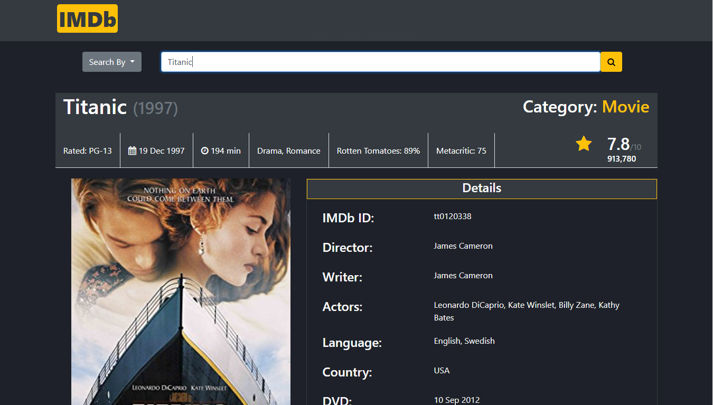

# IMDB

This is an application that enables user to search movie titles using various parameters - By Imdb Id or title or year. The backend used here is http://www.omdbapi.com . Jquery Ajax is used to change the requests according to options selected by user and show the response received(search results) by the API

[Click here](https://sharan3009.github.io/imdb) to check the website.

### Screenshot
 

### Built With
* HTML5
* CSS3
* Jquery Ajax